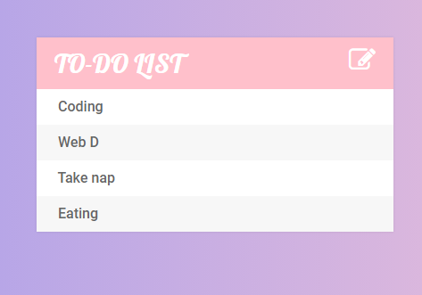
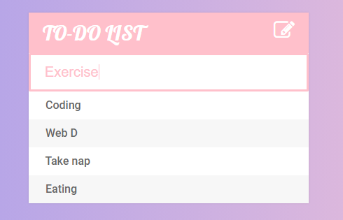
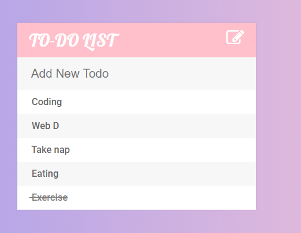
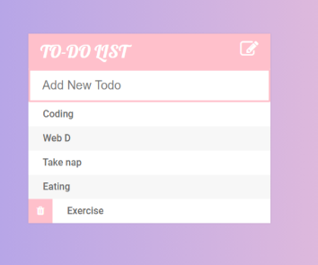

# TODO-List
This is a simple to-do list made using HTML,CSS and jQuery
## Key-features:
1. User can update his/her regular tasks
2. Marked them as completed
3. Delete them if no longer in use.

## Functioning of TODO List-

### The way it looks at the start.

### When you wanted to add new task, click on the icon appearing in the top-right corner.

### When you want to mark the task as done, just click on the task.

### When you want to permanently remove any task, just hover over it, you will be seeing a icon of dustbin, click over it.

