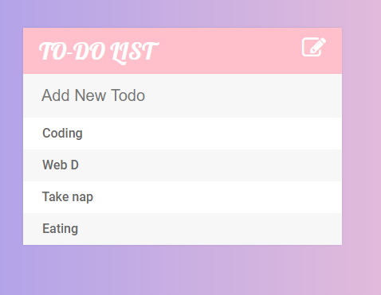

# TODO-List
This is a simple to-do list made using HTML,CSS and jQuery
## Key-features:
1. User can update his/her regular tasks
2. Marked them as completed
3. Delete them if no longer in use.

## How it looks..

